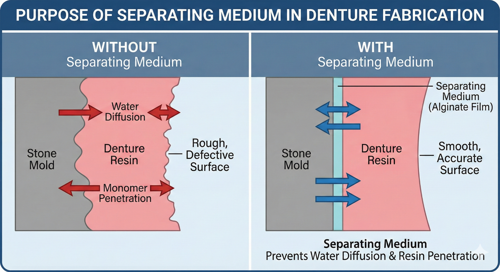

## **PROSTHETIC POLYMERS & DENTURE BASE RESINS (PMMA) — Detailed High-Yield Summary**

### **1\) Key Terms (Exam definitions \+ clinical meaning)**

**Inhibitor**

* **Definition:** Added to monomer to prevent unwanted polymerization during storage → increases shelf life.  
* **Example:** **Hydroquinone** in MMA liquid.  
* **Clinical impact:** Prevents monomer bottle from “setting” in storage; **slightly delays curing** → more working time.

**Liner**

* **Definition:** Polymeric material used to replace the **tissue-contacting (intaglio)** surface of an existing denture.  
* **Purpose:** Improve **fit, comfort, tissue adaptation**.

**Soft liner**

* **Definition:** Resilient polymer placed on tissue surface to absorb masticatory energy (**shock absorber**).  
* **Functions:** Comfort, distributes force, can engage undercuts → improves **retention/stability/support**.

**Short-term soft liner (Tissue conditioner)**

* **Definition:** Used briefly (**≤14 days**) to adapt to changing ridge (post-extraction/surgery).  
* **Key composition feature:** Often **chemically activated** \+ **plasticizers**.  
* **Why temporary:** Plasticizers **leach out** → becomes **hard/rough**, loses cushioning.

**Long-term soft liner**

* **Definition:** Resilient liner intended up to \~**1 year**.  
* **Processing:** Usually **heat-processed** → more durable than short-term.  
* **Limitations:** Still degrades → discoloration, odor, Candida, bond failure.

**Relining**

* **Definition:** Replacing only the **tissue surface** of existing denture (teeth \+ most base remain).  
* **Goal:** Restore adaptation after ridge resorption **without remaking** denture.

**Rebasing**

* **Definition:** Replacing the **entire denture base**, keeping the **teeth**.  
* **Indication:** Base is defective/old/warped/stained but teeth acceptable.

---

### **2\) What is a Complete Denture?**

* A **removable prosthesis** replacing **all teeth** and associated structures in maxilla/mandible.  
* Components: **Artificial teeth \+ denture base** (tissue contact for support).

---

### **3\) Why PMMA is the Standard Denture Base Resin**

**Main reasons PMMA replaced older materials:**

* **Esthetics:** Can be tinted to simulate gingiva.  
* **Clinical acceptability:** Adequate strength, comfort, easy repairs.  
* **Processing:** Powder–liquid system (dough) → easy flasking and curing.  
* **Biocompatibility:** Generally good; key concern \= **residual monomer**.

---

### **4\) Ideal Requirements of Denture Base Material (High-yield headings)**

**A) Biologic**

* Non-toxic, non-irritant, non-allergenic; compatible with tissues.

**B) Patient acceptability**

* Odorless/tasteless; esthetic, color stable; comfortable, lightweight.

**C) Physical/clinical performance**

* Dimensional stability, adequate strength, low water sorption/solubility, good polish, easy processing.

---

### **5\) Classification of Denture Base Resins**

* **Heat-cured PMMA (most common)**  
* **Self-cured / chemically activated PMMA**  
* **Light-activated resins**  
* **Castable resins**  
* **Injection molded polymers** (nylon/polycarbonate; e.g., Ivocap systems)

---

### **6\) Composition (Powder vs Liquid)**

#### **A) Heat-cure PMMA system**

**Powder (polymer)**

* **PMMA beads** (prepolymerized “pre-shrunk” polymer)  
* **Benzoyl peroxide (BPO)** \= initiator  
* Pigments/opacifiers (gingival shade)

**Liquid (monomer)**

* **Methyl methacrylate (MMA)**  
* **Hydroquinone** \= inhibitor  
* **Cross-linker:** glycol dimethacrylate (\~1–2%)

**Cross-linking concept**

* MMA (one double bond) → linear chains  
* Dimethacrylate (two double bonds) → links chains → net-like structure  
* Effects: ↑ resistance to deformation, ↑ craze/solvent resistance (especially alcohol)

#### **B) Self-cure (chemically activated) PMMA**

**Powder**

* PMMA/copolymer \+ **BPO** initiator \+ pigments/opacifiers ± plasticizers/fillers

**Liquid**

* MMA monomer  
* **Tertiary amine activator** (e.g., dimethyl-p-toluidine) → activates BPO at room temp  
* Cross-linker (1–2%), hydroquinone inhibitor (\~0.006%)

---

### **7\) Separating Medium (Why critical)**

**Purpose**

* Stops water from stone diffusing into resin (affects polymerization/optics).  
* Prevents resin soaking into stone → prevents rough, stuck surface.

**Example**

* Sodium alginate solution forming **calcium alginate film**.

**Precautions**

* Wax/oil contamination ruins film.  
* Mold should be warm, not steaming hot.  
* Avoid coating teeth → reduces tooth–base bond.

---

### **8\) Polymer : Monomer Ratio (Very testable)**

* Pure MMA conversion shrinks a lot (\~**21% volumetric**).  
* Prepolymerized PMMA beads reduce shrinkage.  
* **Accepted ratio:** **3 : 1 (polymer : monomer by volume)**  
  * Shrinkage reduced to \~**6% volumetric**, \~**0.5% linear** (as noted).

**Too much monomer**

* ↑ shrinkage, ↑ time to dough, ↑ porosity risk

**Too little monomer**

* Not all beads wetted → granular/weak acrylic, poor fusion, difficult handling

**One-line exam phrasing**

* “Prepolymerized PMMA beads reduce shrinkage because they reduce the volume of monomer undergoing polymerization shrinkage.”

---

### **9\) Polymer–Monomer Interaction Stages (5 stages)**

**Sandy → Stringy → Dough → Rubbery → Stiff**

1. **Sandy:** beads just wetted, no cohesion  
2. **Stringy:** monomer dissolves bead surfaces → sticky strands  
3. **Dough (IDEAL for packing):** pliable, non-tacky, moldable  
4. **Rubbery:** elastic rebound → inaccurate fit if packed  
5. **Stiff:** rigid/dry; cannot mold

**Temperature effect**

* Warm room → stages pass faster  
* Refrigeration extends working time but avoid condensation contamination.

---

### **10\) Packing \+ Bench Curing (Exam-important)**

**Packing**

* Adapt resin into mold under pressure.

**Overpacking**

* Flask won’t close → increased base thickness → alters **VDO**, tooth movement possible.

**Underpacking**

* Not enough material → voids/porosity as polymerization shrinkage occurs.

**Bench curing (30–60 min at room temp after closure)**

* Equalizes pressure, improves monomer diffusion, improves tooth-base bond (especially with resin teeth).

---

### **11\) Polymerization Chemistry \+ Porosity Mechanism**

**Heat cure**

* Heat (\~\>60°C) decomposes **BPO** → free radicals → chain polymerization  
* **Initiator:** BPO  
* **Activator:** Heat

**Porosity danger**

* Reaction is exothermic \+ stone/resin are poor conductors → heat builds in thick areas.  
* If internal temperature exceeds **MMA boiling point (100.8°C)** → monomer boils → bubbles trapped → **gaseous porosity**.

**Why thick areas porose (palate/lingual flange)**

* Low surface area:volume → heat trapped → monomer vapor bubbles → pores.

---

### **12\) Curing Cycles (Memorizable)**

Common successful cycles:

* **74°C for 8 hours** (no terminal boil)  
* **74°C for 8 hours \+ 100°C for 1 hour**  
* **74°C \~2 hours \+ 100°C for 1 hour**

**Goal balance**

* Avoid overheating (porosity) while minimizing residual monomer (biocompatibility).

---

### **13\) Types of Denture Base Resins (Pros/cons in one place)**

**Heat-cure PMMA**

* Pros: better conversion, lower residual monomer, better color stability, less porosity  
* Cons: needs heat \+ lab precision

**Self-cure PMMA**

* Pros: convenient for repair/reline/trays; no high external heat  
* Cons: more residual monomer (**\~3–5%** vs heat cure **\~0.2–0.5%**) → irritation \+ lower strength, more porosity/distortion

**Pour/Fluid resin**

* Pros: improved adaptation, easier deflasking  
* Cons: tooth shifting, air entrapment porosity, poor bonding, technique sensitive

**Light-activated**

* UDMA matrix \+ microfine silica; camphorquinone initiator; supplied as sheets/ropes

**Injection-molded (e.g., nylon/polycarbonate; Ivocap systems)**

* Pros: constant pressure compensates shrinkage; accuracy, homogeneous base, low free monomer, good impact strength  
* Cons: expensive equipment, special flasks, less craze resistance

---

### **14\) Self-cure vs Heat-cure (Core differences)**

**Self-cure**

* ↑ porosity, ↓ molecular weight, ↑ residual monomer, ↑ creep/distortion, poorer color stability

**Heat-cure**

* ↓ porosity, ↑ molecular weight, ↓ residual monomer, better recovery, better color stability

---

### **15\) Important Numbers (Quick exam facts)**

* **MMA boiling point:** **100.8°C** (very important)  
* PMMA: Knoop hardness \~18–20; tensile strength \~60 MPa; modulus \~2.4 GPa; softens \~125°C

---

### **16\) Defects (Causes \+ Prevention) — Long question ready**

#### **A) Porosity (VVIMP)**

**Causes**

1. **Monomer boiling** in thick areas (temp \>100.8°C)  
2. **Poor mixing** → uneven monomer distribution  
3. **Insufficient pressure / underpacking**  
4. **Pour resin air entrapment**

**Prevention**

* Correct ratio (3:1), homogeneous mixing  
* Pack at dough stage  
* Bench curing (pressure equalization \+ monomer dispersion)  
* Controlled curing cycle  
* Maintain pressure (especially self-cure)

#### **B) Crazing (microcracks)**

**Main causes**

* **Thermal shock** (rapid cooling/quenching)  
* **Solvents** (alcohol-containing mouthwash/cleaners)  
* **Dehydration cycles** (wet–dry fatigue)

**Prevention**

* Bench cool slowly  
* No alcohol soaking  
* Store in water when out of mouth

#### **C) Warpage**

**Causes**

* Premature deflasking while hot  
* Hot water/boiling exposure by patient  
* Friction heat during aggressive polishing  
* During repair: heat \+ shrinkage pull

**Prevention**

* Let flask fully cool before opening  
* Patient: no hot water  
* Use correct polishing technique  
* Repairs: prefer **cold-cure PMMA** \+ **pressure pot** (control exotherm), match CTE

---

### **17\) Water Sorption & Solubility (Clinical relevance)**

**Water sorption**

* Slight expansion can partly compensate shrinkage  
* Water plasticizes → slightly reduces strength/stiffness  
* Small dimensional changes over time

**Solubility**

* PMMA low solubility in oral fluids  
* Organic solvents (alcohol) are the major clinical problem → crazing risk

---

### **18\) Biocompatibility & Allergy (Exam-safe lines)**

* Main issue \= **residual monomer**  
* Self-cure has higher free monomer (3–5%) than heat-cure (0.2–0.5%)  
* More residual monomer → tissue irritation \+ reduced strength (plasticizer effect)  
* Lab safety: monomer contact → dermatitis risk; use gloves/ventilation.

---

### **19\) Relining vs Rebasing (Must-know decision logic)**

**Reline**

* Replace only intaglio surface  
* Use when: occlusion/VDO OK, teeth OK, base acceptable, but fit lost due to resorption

**Rebase**

* Replace entire pink base; teeth retained  
* Use when: base is warped/stained/porous/cracked but teeth acceptable

**If teeth worn \+ VDO lost:** neither → **new denture**

---

### **20\) Soft liners (Short vs Long)**

**Short-term tissue conditioners (≤14 days)**

* Very soft; plasticizer leaching → hard/rough quickly  
* Best: post-surgery, healing ridges, tissue recovery

**Long-term liners (\~months to 1 year)**

* More durable but fail by: delamination, porosity/debris trapping, Candida, odor, discoloration

---

### **21\) Denture Teeth: Resin vs Porcelain (MCQ favorite)**

**Resin teeth (PMMA)**

* Pros: less abrasive, easier adjustment, better impact resistance, can chemically bond to base  
* Cons: wear faster

**Porcelain teeth**

* Pros: excellent wear resistance  
* Cons: abrasive to opposing enamel, no chemical bond (mechanical retention via diatorics/pins), possible dark line at junction

---

## **Denture Cleansers & Adhesives — Summary**

### **A) Denture Cleansers**

**Why important**

* Dentures collect plaque, stains, calculus, Candida → stomatitis, odor, staining, reduced retention.

**Ideal cleanser goals**

* Removes biofilm/stains safely, antibacterial/antifungal, non-toxic, compatible with PMMA/metal/liners, doesn’t cause roughness/warpage/corrosion.

**Methods**

1. **Mechanical:** brushing (daily core), ultrasonic (adjunct)  
2. **Chemical soaking:** alkaline peroxide tablets, hypochlorite, acids, disinfectants, enzymatic  
3. Selected: microwave disinfection (protocol dependent)

**Key products**

* **Alkaline peroxide tablets:** effervescence loosens debris; mild bleaching; best after brushing  
* **Hypochlorite (bleach):** strong antifungal/antibacterial \+ stain removal BUT corrodes metal, can bleach acrylic  
* **Acid cleansers:** remove calculus; can corrode metal  
* **Chlorhexidine:** useful in Candida/stomatitis but stains with long use  
* **Enzymatic:** breaks mucin/organic film (protease/amylase)

**Big “Don’ts”**

* No abrasive toothpaste (scratches acrylic)  
* No hot/boiling water (warpage)  
* Be careful with bleach on partial dentures (metal corrosion)  
* Soft liners: avoid harsh cleansers (leaching/roughness/Candida)

**Daily routine**

* Brush denture (especially tissue surface) \+ rinse  
* Night soak (appropriate cleanser/water) \+ store immersed

---

### **B) Denture Adhesives**

**Definition**

* Non-toxic soluble material applied to intaglio surface to improve retention/stability by improving the saliva film interface.

**How they work**

* Hydrate → swell → fill gaps → ↑ viscosity/adhesion/cohesion → better seal & comfort.

**Indications**

* Immediate dentures, xerostomia, mild resorption/borderline retention, neuromuscular issues, short-term confidence.

**Contraindications**

* Grossly ill-fitting denture, fractures/missing flanges, poor hygiene, allergy, pathology needing treatment.  
* Exam line: **“Adhesives are adjuncts, not substitutes for correct dentures.”**

**Types**

* Cream/paste (strong hold), powder (thin film), strips (clean but bulky feeling)

**Red flags → needs correction, not more adhesive**

* Increasing adhesive use, rocking, recurrent sore spots, persistent food packing → likely needs adjustment/reline/rebase/new denture.

---

## **Ultra-High-Yield “Exam Answer Lines”**

* Hydroquinone is an **inhibitor** in MMA preventing storage polymerization.  
* BPO is the **initiator**; **heat** is the activator in heat-cure PMMA.  
* Stages: **sandy → stringy → dough → rubbery → stiff**; pack at **dough** stage.  
* Bench curing (30–60 min) improves monomer diffusion, pressure equalization, and tooth–base bond.  
* Avoid exceeding **100.8°C** (MMA BP) to prevent **gaseous porosity**.  
* Self-cure has higher residual monomer than heat-cure → more irritation \+ lower strength.

If you want, I can compress this into a **1-page exam sheet** (only the lines that come in MCQs/long questions).

# 

# 

# 

# 

# **PROSTHETIC POLYMERS & DENTURE BASE RESINS (PMMA) — COMPREHENSIVE NOTES**

---

# **1\) KEY TERMS (EXAM DEFINITIONS \+ WHAT THEY MEAN CLINICALLY)**

### **Inhibitor**

**Definition:** Component added to monomer liquid to **prevent undesirable polymerization during storage** → increases **shelf life**.  
 **Example in denture resins:** **Hydroquinone** in MMA liquid.  
 **Clinical/handling impact:**

* Prevents premature “setting” of monomer bottle.

* **Retards curing** → gives **more working time**.

  ---

  ### **Liner**

**Definition:** Polymeric material used to replace the **tissue-contacting (intaglio) surface** of an existing denture.  
 **Purpose:** Improve **fit**, comfort, and tissue adaptation.

---

### **Denture Soft Liner**

**Definition:** Polymeric material placed on **tissue surface** of denture base to absorb masticatory impact energy (acts as **shock absorber**).  
 **Functions:**

* Cushions tissues against chewing forces.

* Can engage **undercuts** → improves **retention, stability, support**.

  ---

  ### **Short-Term Soft Liner (Tissue Conditioner)**

**Definition:** Resilient polymer used for **brief periods (≤14 days)** to absorb impact and adapt to changing ridge contours (post-extraction/surgery).  
 **Composition feature:** Usually **chemically activated** and contains **plasticizers**.  
 **Why temporary:** Plasticizers **leach out** → becomes harder \+ rougher \+ less effective.

---

### **Long-Term Soft Liner**

**Definition:** Resilient polymer bonded to tissue surface for cushioning/retention, intended for **up to \~1 year**.  
 **Typical processing:** Usually **heat-processed** → more durable than short-term liners.  
 **Limitations:** Still degrades over time; not “permanent” in most systems.

---

### **Relining**

**Definition:** Replacing the **tissue-contacting surface** of an existing denture (teeth \+ most base remain).  
 **Goal:** Restore adaptation after ridge resorption without remaking entire denture.

---

### **Rebasing**

**Definition:** Replacing the **entire denture base** of an existing denture (teeth retained).  
 **Indication:** When base is defective/old but teeth are acceptable.

* 

# **OVERVIEW OF THE CHAPTER CONTENT (WHAT THIS CHAPTER COVERS)**

This text surveys:

* Materials/techniques to fabricate **dentures** and denture-related materials.

* Main focus: **polymeric materials** used in:

  * **Denture base resins**

  * **Denture teeth**

* Also includes overview of resilient materials used for:

  * **Maxillofacial prostheses**

  * **Soft liners**

  * Custom tray resins

  * Denture cleansers

  * Toxicology & allergy

---

# **2\) WHAT A COMPLETE DENTURE IS ?**

* A **complete denture** \= removable prosthesis replacing **all teeth** and associated structures in maxilla/mandible.  
* Components: **artificial teeth \+ denture base** (tissue contact for support).

---

# **3\) WHY PMMA (ACRYLIC) IS THE STANDARD DENTURE BASE RESIN**

### **Why it replaced earlier materials (core reasons)**

* **Esthetics:** Colorless → can be tinted (gingival simulation)  
* **Clinical acceptability:** Adequate strength, easy repairs, acceptable comfort  
* **Processing:** Powder-liquid dough system → easy flasking and curing  
* **Biocompatibility:** Generally acceptable; major issue is **residual monomer** (see later)

---

# **4\) IDEAL REQUIREMENTS OF A DENTURE BASE MATERIAL** 

**A) Biologic / physiologic**

* Nontoxic, nonirritant, nonallergenic  
* Compatible with oral tissues, does not promote disease.

**B) Patient acceptability**

* Odorless, tasteless  
* Esthetic \+ color stable  
* Comfortable, light weight; acceptable “feel.” 

**C) Physical / clinical performance**

* Dimensional stability, adequate strength, minimal water sorption/solubility, good finish/polish, simple processing. 

---

# **5\) CLASSIFICATION OF DENTURE BASE RESINS (HIGH-YIELD)**

1. **Heat-cured acrylic resin (PMMA)** *(most common)*  
2. **Self-cured / chemically activated acrylic resin**  
3. **Light-activated denture base resins**  
4. **Castable denture base resins**  
5. **Injection-molded polymers** (e.g., nylon/polycarbonate systems) 

---

# **6\) COMPOSITION (WHAT’S IN POWDER VS LIQUID)**

## **A) Heat-cure PMMA system (classic)**

### **Powder (polymer)**

* **PMMA beads** (prepolymerized “preshrunk” polymer)  
* **Benzoyl peroxide (BPO)** \= **initiator** (forms free radicals when activated)   
* Pigments/opacifiers may be present (for gingival shade)

### **Liquid (monomer)**

* **Methyl methacrylate (MMA)**  
* **Hydroquinone** \= inhibitor (prevents storage polymerization)   
* **Cross-linker:** commonly **glycol dimethacrylate \~1–2%** (reduces crazing, improves solvent resistance) 

  ## **Cross-linking concept** 

* MMA has **1 double bond** → makes linear chains

* Glycol dimethacrylate has **2 double bonds** → can join **two separate chains**  
   → creates **net-like structure**  
   **Effect:**

* More resistance to deformation

* Improves resistance to solvent/ethanol swelling (but excessive cross-linking can create swelling issues in some solvents)

---

## **B) Chemically activated (self-cure) resin — composition emphasis**

Slides list typical components: 

### **Powder**

* PMMA / copolymer (\~5% listed)  
* **BPO initiator**  
* Dyes, opacifiers (e.g., Zn/Ti oxides)  
* Plasticizer (e.g., dibutyl phthalate) \+ fillers (some systems)

### **Liquid**

* MMA monomer  
* **Tertiary amine activator** (e.g., dimethyl-p-toluidine) → decomposes BPO at room temp  
* Cross-linker (glycol dimethacrylate 1–2%)  
* Hydroquinone inhibitor (\~0.006%)

Process of polymerization explained in composite 

---

# **7\) DENTURE FABRICATION FLOW  (can skip)**

1. Impression  
2. Gypsum cast  
3. Record base  
4. Wax rim \+ tooth arrangement  
5. Try-in (esthetics/occlusion)  
6. Flasking \+ investing in stone  
7. Wax elimination (boil-out)  
8. Clean mold  
9. Apply separating medium  
10. Mix resin → reach **dough stage**  
11. Pack into mold (trial closures)  
12. Bench curing  
13. Polymerization (curing cycle)  
14. Cooling (bench cool → water cool)  
15. Deflask → finish → polish → deliver

---

# **8\) SEPARATING MEDIUM (WHY IT’S CRITICAL)**

**Purpose**

1. Prevent **water diffusion** from stone into resin → affects polymerization/optics/properties  
2. Prevent monomer/polymer soaking into stone → stone adheres → rough defective surface  
     
   **Common separator:** **Sodium alginate solution** forming film (calcium alginate barrier).   
3. 

****

**Precautions:**

* Wax/oil contamination ruins separator action  
* Mold should be **warm, not hot** (film breaks if steaming)  
* **Avoid coating teeth** → reduces tooth–base bond 

---

# **9\) POLYMER : MONOMER RATIO** 

**Why needed**

* Pure MMA → PMMA conversion causes about **21% volumetric shrinkage**.   
* Manufacturers include **prepolymerized PMMA beads** (“preshrunk”) to reduce shrinkage.

**Accepted ratio:** **Polymer : monomer \= 3 : 1 (by volume)** 

* Slides state: with this ratio → volumetric shrinkage \~**6%** and linear shrinkage \~**0.5%**. 

**If too much monomer**

* ↑ polymerization shrinkage  
* ↑ time to reach packing consistency  
* ↑ porosity risk

**If too little monomer**

* Not all beads wetted → granular/weak acrylic, poor fusion, hard dough handling 

### **What’s actually happening**

**Polymerization shrinkage happens mainly in the *monomer*** (MMA) when it converts to polymer (PMMA).  
 So if you **replace part of the “shrinkable” monomer volume** with **already-polymerized (pre-cured) PMMA** particles/pieces, you get **less net shrinkage**.

### **Why “already cured beads/pieces” reduce shrinkage**

* **Pre-cured PMMA has already finished shrinking** during its own polymerization.

* When you add pre-cured beads/pieces, they act like **inert filler/volume**.

* That means **less fresh monomer** is present → **less polymerization shrinkage** overall.

* Bonus: often **less exotherm** (heat) → can reduce **porosity** risk too.

### **The key clarification**

In conventional heat-cure acrylic denture base resin, the **powder is already pre-polymerized PMMA beads** and the liquid is **monomer**.

So this “anti-shrinkage trick” is **already built into the standard powder–liquid system**.

### **Limits / cautions**

* It **reduces**, but does **not eliminate**, shrinkage/warpage (because there’s still monomer polymerizing).

* If you add **large chunks/pieces** (not fine beads), you can create:

  * **weak spots / poor bonding**

  * **voids**

  * **roughness** and processing issues

### **One-line exam phrasing**

**Adding pre-polymerized PMMA beads reduces shrinkage because they decrease the amount of monomer that undergoes polymerization shrinkage (beads have already “undergone the process”).**

---

# **10\) POLYMER–MONOMER INTERACTION STAGES (VERY HIGH-YIELD)**

From the deck: **Sandy → Stringy → Dough → Rubbery/Elastic → Stiff** 

1. **Sandy:** minimal interaction  
2. **Stringy:** monomer attacks bead surfaces → sticky strings  
3. **Dough-like (IDEAL):** pliable, not tacky → **pack here**  
4. **Rubbery/elastic:** monomer dissipates; rebounds; cannot mold properly  
5. **Stiff:** monomer loss; dry, resistant

**Dough forming time:** slides note most reach dough in **\<10 min**.

# **POLYMER–MONOMER INTERACTION: 5 STAGES** 

When powder \+ liquid mixed → passes through:

Getting the timing right is crucial because if you pack the material too early, it's a sticky mess; if you wait too long, it’s a rock. Here is the detailed breakdown of what is happening chemically and physically during those stages.

---

## **1\. Sandy Stage**

When you first mix the powder (polymer) and liquid (monomer), they haven't reacted yet.

* **The Texture:** It feels like wet sand. There is no cohesion.  
* **What’s Happening:** The polymer beads are simply being wetted by the monomer. No significant dissolution has occurred.  
* **Interaction:** Minimal. If you try to move it, it just falls apart.

## **2\. Stringy (Sticky) Stage**

This is where the "attack" begins.

* **The Texture:** Very tacky. If you touch it with a spatula and pull away, it forms thin, spider-web-like strings.  
* **What’s Happening:** The monomer begins to dissolve the surfaces of the polymer beads. Long polymer chains are untangling and "reaching out" into the liquid, creating that sticky, stringy consistency.  
* **Action:** **Do not handle** yet; it will stick to your gloves and instruments.

## **3\. Dough Stage (The "Sweet Spot")**

As you noted, this is the **ideal time for packing** into a mold or flask.

* **The Texture:** Pliable, moldable, and—crucially—**not tacky**. It should feel like bread dough or putty.  
* **What’s Happening:** A large amount of the polymer has dissolved in the monomer. We now have a saturated solution of polymer in monomer.  
* **Why it's perfect:** It has "plasticity." You can deform it into a mold, and it will stay there without sticking to the walls or your fingers.

## **4\. Rubbery (Elastic) Stage**

The window of opportunity for molding is closing here.

* **The Texture:** It becomes bouncy. If you squeeze it or stretch it, it snaps back to its original shape.  
* **What’s Happening:** The monomer is being absorbed deeper into the beads or evaporating. The chains are becoming more entangled and "locked," preventing free flow.  
* **Action:** It can no longer be compression molded because it will "rebound," leading to an inaccurate fit.

## **5\. Stiff (Rigid) Stage**

The final stage before it fully sets (cures).

* **The Texture:** Hard, dry, and resistant to any deformation.  
* **What’s Happening:** Continued evaporation of the monomer and further stabilization of the polymer matrix.  
* **Result:** The material is now "stiff." In the case of heat-cured acrylics, it stays in this state until heat is applied to trigger the final polymerization.  
* 

---

### **Summary Table for Quick Reference**

| Stage | Physical State | Clinical Action |
| :---- | :---- | :---- |
| **Sandy** | Grainy | Mixing |
| **Stringy** | Tacky/Sticky | Wait |
| **Dough** | **Pliable/Non-tacky** | **Pack into mold** |
| **Rubbery** | Elastic Rebound | Too late to mold |
| **Stiff** | Rigid/Dry | Final Curing |

**Pro Tip:** The "Dough Forming Time" is temperature-sensitive. If your room is very hot, you'll fly through the Dough stage into the Rubbery stage much faster. Keep your mixing jar cool to extend your working time.

**Temperature effect:**

* Refrigeration extends working time

* BUT risk: condensation → moisture contamination

* Prevent by airtight container; don’t open until room temp

---

# **11\) PACKING \+ BENCH CURING (WHY IT MATTERS)imp**

### **Packing (definition)**

* Placement/adaptation of resin into mold cavity \= **packing**. 

**Overpacking**

* Excess thickness \+ tooth malposition 

**Underpacking**

* Denture base porosity

### **Bench curing**

* After final closure, keep flasks at room temp **30–60 min** \= **bench curing**. 

**Benefits**

* Equalizes pressure through mold  
* Allows uniform monomer dispersion  
* If resin teeth used → longer monomer contact → **better tooth–base bond** 

  ### **.The Goldilocks Principle: Overpacking vs. Underpacking**

Getting the exact volume of acrylic dough is crucial. Deviations in either direction lead to specific failures.

* **Overpacking (Too Much Material)**  
  * **Cause:** Excessive resin is placed in the mold, preventing the two halves of the flask from closing completely (metal-to-metal contact).  
  * **Consequences:**  
    * **Excess thickness:** The resulting denture base will be thicker than the original wax pattern. This increases the Vertical Dimension of Occlusion (VDO), messing up the bite.  
    * **Tooth malposition:** The excess pressure tries to escape, potentially shifting the teeth out of their set positions in the plaster.  
* **Underpacking (Not Enough Material)**  
  * **Cause:** Insufficient resin is placed to fill the entire mold cavity.  
  * **Consequences:**  
    * **Denture base porosity:** Acrylic shrinks as it cures (polymerizes). If there isn't enough material packed under pressure to compensate for this shrinkage, voids (bubbles) will form within the denture base. This makes the denture weak, prone to staining, and unhygienic.

  

---

# **12\) POLYMERIZATION (CURING) CHEMISTRY**

### **Heat-cure mechanism**

* Heat \> \~60°C → **benzoyl peroxide decomposes → free radicals** → initiates chain polymerization.)  
* Therefore:  
  * **Activator \= heat**  
  * **Initiator \= benzoyl peroxide** 

### **Temperature rise \+ porosity danger**

* Resin \+ stone are poor thermal conductors → reaction heat builds up  
* Resin temperature must not exceed **MMA boiling point \= 100.8°C**; otherwise monomer boils → internal porosity. 

---

# **13\) CURING CYCLES (MEMORIZABLE OPTIONS)**

Slides list successful cycles:

1. **74°C water bath for 8 hours or longer** (no terminal boil)  
2. **74°C for 8 hours → then 100°C for 1 hour**  
3. **74°C for \~2 hours → then 100°C for 1 hour**

**Concept:** Avoid uncontrolled overheating (porosity) but still achieve good conversion (less residual monomer).

The goal of any processing cycle is to manage two opposing risks:  **imp**

1. **Risk of Overheating (Gaseous Porosity):** If the external heat of the water bath *plus* the internal heat of the exothermic reaction pushes the temperature inside the denture dough above \~100.8°C while it is still soft, the monomer will boil. These monomer gas bubbles get trapped, creating **gaseous porosity**. This weakens the denture and makes it unhygienic.

   ### **Why porosity/bubbles form in thick areas (palate of maxillary denture, lingual flange of mandibular denture)**

**Core mechanism \= heat build-up \+ monomer boiling.**

1. **Thick sections act like insulation**

* PMMA polymerization is **exothermic** (releases heat).

* **Thicker acrylic** has a **low surface-area : volume ratio**, so heat **can’t escape** fast enough.

2. **Temperature rises more in thick areas**

* The center of thick portions (palatal plate / lingual flange) becomes the **hottest zone**.

3. **If temperature reaches monomer boiling point → vapor bubbles**

* Residual monomer (MMA) can **boil/volatilize** when overheated.

* The vapor forms **gas bubbles** inside the resin.

4. **Bubbles get trapped → “gaseous porosity”**

* As the resin sets, those bubbles **cannot escape** and become **pores/voids**.

✅ **So:** thick areas overheat → monomer vaporizes → pores.

### **(one-liner)**

**“Thick denture areas retain exothermic heat; temperature may exceed the monomer’s boiling point, producing vapor bubbles that become gaseous porosity.”**

### **Quick add-on (if they ask “how to prevent”)**

Use a **controlled curing cycle** (slow/long, avoid rapid boiling cycle)

**Bench cure** before heating (helps monomer distribution \+ pressure equalization)

Ensure **proper packing/pressure** (reduces voids and compensates shrinkage)

**Risk of Underheating (Residual Monomer):** If the temperature isn't high enough or maintained long enough, the chemical reaction doesn't finish. This leaves behind unreacted "residual monomer," which can irritate patient tissues and compromise the material's physical properties.

---

# **14\) TYPES OF DENTURE BASE RESINS (DETAILS \+ PROS/CONS)**

## **A) Heat-cured PMMA (gold standard)**

**Pros**

* Better conversion → **lower residual monomer**  
* Better color stability, lower porosity (compared with self-cure) 

**Cons**

* Heat required; deflasking can be harder; processing demands accuracy.

---

## **B) Self-cured (chemically activated) PMMA**

**Activation**

* Tertiary amine causes BPO decomposition → radicals at room temp 

**Major problems (slides)**

* More unreacted monomer causes:  
  1. **Plasticizer effect → ↓ transverse strength**  
  2. **Tissue irritant → ↓ biocompatibility** 

**Processing notes**

* Working time shorter; cooling the liquid/mixing vessel prolongs working time   
* Maintain pressure throughout polymerization  
* Initial hardening \~30 min, but **hold under pressure ≥3 hours** for sufficient polymerization   
* Free monomer: **self-cure 3–5%** vs **heat-cure 0.2–0.5%** 

**Common uses**

* Denture repair, relining/rebasing, special trays, ortho appliances, temporary crowns/FPDs, etc. 

---

## **C) Fluid resin (pour) technique**

**Core differences**

* Smaller high-MW powder particles → very fluid mix   
* Lower powder:liquid ratio **2:1 to 2.5:1** (  
* Agar hydrocolloid mold; polymerize under pressure **0.14 MPa** 

**Advantages**

* Improved tissue adaptation  
* Less damage during deflasking  
* Simplified lab steps, lower material cost

**Disadvantages**

* Tooth shifting  
* Air entrapment porosity  
* Poor tooth bonding  
* Technique sensitive 

---

## **D) Light-activated denture base resin**

* Composite-like: **urethane dimethacrylate matrix \+ microfine silica**  
* **Activator:** visible light  
* **Initiator:** camphorquinone   
* Supplied as sheets/ropes; base formed on cast then cured in light unit 

---

## **E) Injection-molded polymers (nylon / polycarbonate systems)**

Slides mention **SR-Ivocap** injection system:

* Constant pressure (example noted **\~3000 lbs**) during processing to compensate shrinkage 

**Advantages**

* Dimensional accuracy; homogeneous base; low free monomer; good impact strength 

**Disadvantages**

* Expensive equipment; special flasks; less craze resistant; complex mold design 

---

# **15\) COMPARISON: SELF-CURE vs HEAT-CURE** 

### **Self-cure**

* More porosity  
* Lower average molecular weight → weaker  
* Higher residual monomer  
* More distortion \+ creep \+ slow recovery  
* Poor color stability

### **Heat-cure**

* Less porosity  
* Higher molecular weight  
* Lower residual monomer  
* Less distortion \+ less creep \+ quicker recovery  
* Better color stability

---

# **16\) IMPORTANT MATERIAL VALUES (QUICK FACTS)**

### **MMA (monomer)**

* Boiling point: **100.8°C (Imp)**   
    
* Density: **\~0.945 g/mL at 20°C**  
* Heat of polymerization: **\~12.9 kcal/mol**

### **PMMA (polymer)**

* Knoop hardness: **\~18–20**  
* Tensile strength: **\~60 MPa**  
* Modulus of elasticity: **\~2.4 GPa**  
* Softens around **\~125°C**

---

# **17\) DEFECTS & CLINICAL CONSEQUENCES (WHAT TO WRITE IN LONG QUESTIONS) vvimp**

## **A) Porosity — causes \+ prevention vvimp**

**Why it matters:** ↓ strength, ↓ esthetics, plaque harboring.

**Main causes**

**1\) Internal porosity from monomer boiling**

* thick sections retain heat

* resin temp \>100.8°C → monomer boils → voids  
   Prevent: controlled curing cycle, slower heating

**2\) Porosity from inadequate mixing**

* uneven monomer distribution

* localized shrinkage → large voids  
   Prevent: correct ratio \+ homogeneous mixing \+ pack at dough stage

**3\) Porosity from insufficient pressure / insufficient material**

* irregular voids  
   Prevent: correct packing, maintain pressure

**4\) Fluid resin porosity**

* air entrapment during mixing/pouring  
   Prevent: careful mixing, spruing/venting

**Prevention**

* Correct ratio (3:1)  
* Pack at **dough stage**  
* Bench curing (pressure equalization \+ monomer dispersion)  
* Controlled curing cycle (74°C cycles ± terminal boil)  
* Maintain pressure in self-cure ≥3 hours

---

## **B) Crazing (microcracks)**

**Crazing** refers to the formation of microcracks on the surface of the denture base resin.

* **Causes:** It is typically caused by tensile stress or stresses induced during processing. Additionally, exposure to certain solvents can exacerbate these microcracks.

  ### **The Clinical Consequence**

* **Visual:** The denture starts to look "hazy" or "foggy" (this is actually millions of micro-cracks refracting light).  
* **Structural:** The denture loses its toughness. It becomes brittle and can snap easily during normal chewing or if dropped.  
* **Hygiene:** Those micro-cracks become breeding grounds for bacteria and *Candida* that a toothbrush cannot reach.  
  ****

### **1\. Thermal Shock (Processing Error)**

This is the most common laboratory cause of crazing outside of simple mechanical stress.

* **Cause:** **Rapid Cooling (Quenching).** If the flask is removed from the hot water bath and immediately plunged into cold water, the sudden temperature drop causes the outer surface of the resin (and the stone mold) to contract much faster than the inner core.  
* **Mechanism:** This differential contraction creates massive internal tension on the surface of the denture, causing it to "craze" or form microcracks to relieve the stress. This is often seen around **porcelain teeth** because porcelain contracts at a different rate than acrylic (Coefficient of Thermal Expansion mismatch).  
* **Prevention:** **Bench Cool Slowly.** Always allow the flask to cool on the bench to room temperature before putting it in cold water or opening it.

### **2\. Solvent Action (Patient/Clinical Error)**

* **Cause:** Exposure to volatile liquids or harsh chemicals.  
* **Mechanism:** Certain solvents (like alcohol) penetrate the polymer chains and act as a wedge, forcing the chains apart and causing surface separation.  
* **Prevention:**  
  * **Avoid Alcohol:** Advise patients strictly against soaking dentures in alcohol-containing mouthwashes or using isopropyl alcohol for cleaning.  
  * **Avoid Sterilizers:** Do not use ethylene oxide or high-heat sterilization on standard acrylics.

### **3\. Dehydration (Storage Error)**

* **Cause:** Leaving the denture out of water for extended periods.  
* **Mechanism:** Acrylic absorbs water (sorption) and expands slightly. When it dries out (desorption), it contracts. Repeated cycles of wet/dry act like bending a paperclip back and forth—it fatigues the surface, leading to cracks.  
* **Prevention:** **Keep Hydrated.** Instruct patients to store dentures in water or a denture solution whenever they are not in the mouth

POINT 2 AND 3 ARE MORE RELEVANT FOR A DENTIST SO FURTHER DETAIL

 Here is the breakdown of those specific clinical warnings:

### **1\. The "No Alcohol" Rule (Solvent Action)**

* **The Advice:** "Never soak your denture in mouthwash containing alcohol or clean it with rubbing alcohol."  
* **The "Why":** Organic solvents like alcohol act as a chemical wedge. They penetrate the polymer chains of the acrylic, causing them to separate.(DESTROYS THE DENTURE STRCUTRE)  
* **The Result:** This leads to **surface crazing (microcracks)** which weakens the denture and makes it more prone to staining and plaque accumulation.  
* **Board/Clinical Note:** Many commercial mouthwashes contain high alcohol. Patients often think this "disinfects" the denture, but it actually destroys the material structure over time.

### **2\. The "Keep it Wet" Rule (Water Sorption/Desorption)**

* **The Advice:** "When the denture is not in your mouth, it must be submerged in water or a soaking solution. Never wrap it in a dry tissue or leave it on the nightstand."  
* **The "Why":** Acrylic is like a sponge; it absorbs water (expansion) and loses it when dry (contraction).  
* **The Result:**  
  * **Cycling Stress:** Going from wet (mouth) $\\rightarrow$ dry (nightstand) $\\rightarrow$ wet (mouth) creates repeated expansion and contraction cycles.  
  * **Fatigue:** This constant changing of shape fatigues the material, leading to **cracking** or warping that ruins the fit.  
* **Clinical Pearl:** If a patient presents with a denture that "doesn't fit like it used to" and you see crazing, ask if they let it dry out at night.

### **Summary for Patient Education**

**"To prevent cracking and warping:**

1. **NO Alcohol:** Do not use hot water or alcohol-based cleaners.  
2. **Stay Wet:** Keep the denture in water whenever it is out of your mouth to maintain its shape."

## ---

**C) Warpage**

 Refers to the distortion or deformation of the denture base, resulting in a change in shape that compromises the fit and stability of the prosthesis.

It is caused by the release of internal stresses (strains) that were locked into the material during processing. When these stresses relax, the plastic moves, and the denture warps.

**Simple words:**

Change in shape of the denture leading to poor fit.

### **1\. Main Causes (The "Stress Releasers")**

* **Premature Deflasking (Lab Error):**  
  * **Mechanism:** Removing the denture from the flask while it is still hot.  
  * **Why:** At high temperatures, the acrylic is still slightly soft and the internal stresses are high. If you pry it out of the rigid stone mold before it is fully rigid and cool, it will distort immediately.  
  * **Rule:** The flask must be completely cool to the touch before opening.  
* **Thermal Shock / Boiling Water (Patient Error):**  
  * **Mechanism:** Placing the denture in boiling or very hot water.  
  * **Why:** Heat softens the acrylic chains (approaching the glass transition temperature), allowing those locked-in processing stresses to release. The denture tries to return to its original "relaxed" state, which is often a warped shape.  
  * **Clinical Consequence:** The patient returns claiming the denture "suddenly doesn't fit."  
* **Friction Heat from Polishing (Lab/Clinic Error):**  
  * **Mechanism:** Aggressive polishing with a dry wheel or high speed.  
  * **Why:** Friction generates localized intense heat, enough to soften the surface and cause warpage, especially in thinner areas.

This question was in FCPS EXAM so 

**Denture repair** is a classic cause of warpage if done incorrectly.

In fact, avoiding warpage is the **primary reason** we use specific materials and techniques for repairs.

### **How Repair Leads to Warpage**

#### **1\. The Heat Trap (Re-heating the Old Base)**

This is the most common exam concept regarding repairs.

* **The Problem:** The original denture base has "internal stresses" locked inside it from when it was first made. If you heat the entire denture again (e.g., to cure the repair acrylic in hot water), you relax those stresses.  
* **The Result:** The denture tries to go back to its original shape or distorts.  
* **The Rule:** This is why we almost **NEVER use heat-cured acrylic** for chairside or simple repairs. Re-processing the whole denture in a hot water bath will warp the existing base.

#### **2\. Polymerization Shrinkage (The "Pull")**

* **The Problem:** The new acrylic you add to the fracture line shrinks as it hardens.  
* **The Result:** If the fracture gap is wide, the shrinking repair material acts like a tight rubber band, pulling the two halves of the denture toward each other.  
* **Clinical Effect:** The heels (flanges) of the denture might be pulled closer together, making the denture too narrow to fit the ridge.

### **The Prevention Strategy ( Exam "Must-Know")**

To prevent warpage during a repair, we follow two specific rules:

1. **Use "Cold-Cure" Acrylic:**  
   * Also called **Auto-polymerizing** or **Self-cure** resin.  
   * **Why?** It cures chemically without needing high external heat. This protects the old denture base from thermal distortion.  
2. **Pressure, Not Heat:**  
   * We place the repair in a **Pressure Pot** (warm water \+ air pressure) rather than boiling water.  
   * **Why?** The pressure makes the repair dense (removes bubbles/porosity) without the high temperatures that would warp the denture.

### **Summary Table**

| Repair Method | Risk of Warpage | Why? |
| :---- | :---- | :---- |
| **Heat-Cure Repair** | **HIGH** | Re-heating releases original processing stresses $\\rightarrow$ distortion. |
| **Cold-Cure Repair** | **LOW** | No high heat is applied, so the original shape is preserved. |

**Exam Key Takeaway:**

If a question asks, "Why is auto-polymerizing (cold-cure) resin preferred for denture repairs?"

The answer is: **To prevent warpage (dimensional change) of the existing denture base.**

### **Repair of Denture Base: Why Exotherm \+ Thermal Match Matter (Exam-Structure)**

#### **1\) Problem: Warpage during repair**

A repaired denture can **distort** if the **old base softens** or if the **repair pulls differently** with temperature changes

However, the auto-polymerising material must have similar properties this was asked in exam

## **A) EXOTHERM CONTROL (Prevent warpage NOW, during curing)**

**Key fact:** Even **auto-polymerizing (cold-cure) acrylic** gives off heat (**exothermic reaction**).

**Mechanism**

* Repair resin polymerizes → **heat released**  
* If heat builds up, the old denture base may reach/approach **glass transition temperature (Tg)**  
* Above/near Tg: PMMA becomes **rubbery**, internal stresses relax → **shape changes**

**Result**  
✅ Old base softens locally → **stress release** → **warpage/distortion**

## **B) THERMAL COMPATIBILITY (Prevent cracks LATER, during function)**

**Key concept:** Repair material and old base should behave the same with temperature.

Most important property: **Coefficient of Thermal Expansion (CTE)(this must match)**  
(Conductivity matters, but CTE mismatch causes the major clinical problem.)

**Mechanism**

* Hot soup / cold water → materials expand/contract  
* If repair and base have different CTE:  
  → they move differently → **shear stress at the bond line**

**Result**  
✅ Stress at junction → **crazing/cracks** or **debonding** at repair line

**Why cold-cure PMMA is preferred**

* It’s **chemically similar** to the denture base (PMMA)  
  → **CTE match** \+ better compatibility

## **The “Safe Repair” Formula (1-liner)**

**Prevent warpage \+ failure by:**

1. **Controlling exotherm** (don’t soften the old base)  
2. **Using PMMA-like repair material** (matched CTE → no stress at junction)

### **Board-style clue words**

* **“Distortion during repair”** → think **exotherm \+ Tg \+ pressure pot warm water**  
* **“Cracks/crazing at repair line after use”** → think **CTE mismatch / thermal incompatibility**

---

# **18\) WATER SORPTION \+ SOLUBILITY (CLINICAL RELEVANCE)**

### **Water sorption (PMMA absorbs water)**

* Causes **slight expansion** → can partially compensate polymerization shrinkage  
* Water acts as a **plasticizer** → slight ↓ strength/stiffness  
* Can contribute to minor dimensional changes over time (stress relaxation)

### **Solubility**

* PMMA is virtually insoluble in oral fluids; clinically solubility is low.  
* Main “solvent problems” are with organic solvents (alcohol) → crazing risk; cross-linking improves resistance.

---

# **19\) BIOCOMPATIBILITY, IRRITATION, ALLERGY (EXAM SAFE ANSWER)**

### **Residual monomer \= key issue**

* Self-cure has higher free monomer (3–5%) than heat-cure (0.2–0.5%)   
* More residual monomer:  
  * **Plasticizes resin → ↓ strength**  
  * **Irritates tissues → burning/erythema** 

### **Lab staff hazard**

* Monomer contact → dermatitis risk; use gloves/ventilation (standard clinical safety statement).

---

# **20\) RELINING vs REBASING**

### **Relining**

* Replace **tissue surface only**  
* Indications: ridge resorption, loss of fit with acceptable teeth/base bulk  
* Often uses self-cure (lower heat distortion risk) but must control heat from exotherm and keep pressure.

### **Rebasing**

* Replace **entire denture base**; keep teeth  
* Indications: old/warped/stained base but teeth acceptable  
* More extensive lab procedure than relining.

This is a high-frequency exam topic that tests your ability to determine the **extent of the repair** based on what is actually "broken" or ill-fitting.

## **Relining vs. Rebasing**

The main difference is the **volume of material** being replaced. Think of it like a house: a Reline is like replacing the carpet; a Rebase is like replacing the entire foundation but keeping the roof.

---

### **1\. Relining (The Surface Update)**

**What happens:** You add a new layer of acrylic to the **tissue-contacting surface** of the denture.

* **Primary Indication:** **Loss of fit** due to alveolar ridge resorption.  
* **Requirements:** Everything else about the denture must be good—the teeth are in the right spot, the bite (occlusion) is correct, and the pink plastic isn't broken.  
* **Clinical Pearl:** Often done "chairside" using **self-cure acrylic**.  
  * **The Danger:** The chemical reaction is **exothermic**. If you leave it in the patient's mouth too long while it sets, you can burn the mucosa.  
  * **The Risk:** Potential for porosity and bad odor if not processed correctly.

---

### **2\. Rebasing (The Total Overhaul)**

**What happens:** You replace the **entire pink acrylic base**. Only the original teeth remain.

* **Primary Indication:** The denture base itself is a mess (warped, heavily stained, porous, or multiple cracks), but the **teeth are still in excellent condition**.  
* **The Process:** This is almost always a **laboratory procedure**. The lab uses the old denture to create a mold, strips the teeth out, and processes a brand-new base around them.  
* **Clinical Pearl:** This is much more expensive and time-consuming than a reline. If the teeth are worn down (like we discussed with resin teeth earlier), you shouldn't rebase—you should just make a new denture.

---

### **Comparison Summary**

| Feature | Relining | Rebasing |
| :---- | :---- | :---- |
| **Material Replaced** | Only the tissue surface | The **entire** pink base |
| **Teeth Kept?** | Yes | Yes |
| **Common Reason** | Ridge shrunk (loose fit) | Base is warped, stained, or broken |
| **Complexity** | Simple (can be chairside) | Complex (strictly laboratory) |

### **Exam "Key Phrases" to Watch For:**

* **"Acceptable VDO and occlusion, but poor fit":** Think **Reline**.  
* **"Denture base is porous or stained, but teeth are not worn":** Think **Rebase**.  
* **"Teeth are worn and VDO is lost":** Neither\! The answer is **New Denture**.

---

# **21\) SOFT LINERS (SHORT-TERM vs LONG-TERM) —** 

### **Purpose line (always write)**

* Soft liners act as **shock absorbers** between denture and mucosa → reduce impact forces and improve comfort.

## **Short-term tissue conditioners (≤14 days)**

* Plasticized resilient materials  
* Best for post-surgical/rapidly changing ridge contours  
* Main failure: plasticizer leaches → hard/rough \+ hygiene problems

## **Long-term liners (\~up to 1 year)**

* More durable (often heat-processed)  
* Still degrade; common problems: adhesion failure, discoloration, Candida/odor due to porosity/debris trapping

This is another high-yield topic. Examiners love to test the **failure mechanisms** of these materials because they dictate how often a patient needs to return for maintenance.

## **Soft Liners: Short-Term vs. Long-Term**

The fundamental difference lies in **durability** and **leaching**. While both act as shock absorbers, their chemistry determines their lifespan.

---

### **1\. Short-Term Tissue Conditioners (≤ 14 Days)**

These are your "emergency" or "healing" materials. They are extremely soft but very unstable.

* **Mechanism:** They contain high amounts of **plasticizers** (liquids that keep the polymer soft).  
* **The "Leaching" Problem:** Within two weeks, the plasticizers leak out into the saliva.  
* **Consequence:** The liner becomes **hard, rigid, and abrasive**. It loses its "tissue conditioning" property and can actually irritate the mucosa it was meant to protect.  
* **Best Use Case:** \* Immediate dentures after extractions.  
  * Treating "Denture Stomatitis" (recovering the health of the tissue before taking final impressions).

---

### **2\. Long-Term Soft Liners (Months to 1 Year)**

These are intended for patients with chronic pain, thin/atrophic mucosa, or sharp bony ridges that cannot be surgically corrected.

* **Materials:** Usually **Silicone** or **Heat-Processed Acrylic**.  
* **Common Clinical Failures:**  
  * **Adhesion Failure:** The most common problem. The soft liner peels away from the hard denture base (delamination).  
  * **Candida Growth:** Because these materials are porous, they trap debris. *Candida albicans* loves to live in these pores, leading to persistent fungal infections and foul odors.  
  * **Discoloration:** They absorb stains from coffee, tea, and food much faster than hard acrylic.

---

### **Summary Table for Quick Recall**

| Feature | Short-Term (Tissue Conditioner) | Long-Term Soft Liner |
| :---- | :---- | :---- |
| **Duration** | 3–14 Days | Up to 1 Year |
| **Primary Goal** | Tissue recovery / Post-surgery | Chronic comfort / Atrophic ridges |
| **Main Failure** | **Plasticizer leaching** (becomes hard) | **Candidiasis** and **Adhesion loss** |
| **Porosity** | High | Medium/High |

---

### **Board Exam "Red Flags"**

* **If the question mentions a liner that turned hard and foul-smelling after 3 weeks:** The answer is **leaching of plasticizers** in a short-term liner.  
* **If the question asks about a patient with a long-term liner and white patches on the palate:** The answer is **Candida albicans** colonization due to the material's porosity.  
* **The "Purpose" Answer:** If asked why we use these, always look for the phrase **"distribute forces evenly"** or **"reduce impact."**

---

# **22\) DENTURE TEETH: RESIN vs PORCELAIN (MCQ FAVORITE)**

### **Resin teeth (PMMA)**

**Pros:** better impact resistance, easier adjustment, less abrasive to opposing enamel, chemically bonds well to base if clean  
**Cons:** more wear than porcelain

### **Porcelain teeth**

**Pros:** excellent wear resistance  
**Cons:** abrasive to opposing; no true chemical bond → relies on mechanical retention; junction leakage/dark line possible

**Bonding rule (clinical info not relevant )**

Keep separator/wax off ridge-lap; bench curing \+ monomer wetting improves tooth–base bond 

| Feature | Resin (Acrylic/PMMA) | Porcelain |
| :---- | :---- | :---- |
| **Wear Resistance** | Lower (wears down over time) | **Excellent** (maintains vertical dimension) |
| **Impact Resistance** | **High** (tougher, less likely to chip) | Low (brittle, prone to fracturing) |
| **Opposing Teeth** | Kind to natural enamel | **Highly abrasive** to natural teeth |
| **Bond to Base** | **Chemical bond** (monomer dissolves surface) | Mechanical bond only (requires pins/diatorics) |
| **Adjustment** | Easy to grind and polish | Difficult; requires special burs/polishing |
| **Sound** | Quiet "cushioned" click | Sharp, "clacking" sound |

### **Exam "Must-Knows"**

* **If the question asks about a patient with heavy bruxism (grinding):** Resin is often safer because it absorbs impact, though it will wear faster.  
* **If the question asks about "Diatorics":** The answer is always related to mechanical retention for **porcelain posteriors**.  
* **Bonding Rule:** To ensure a solid bond for resin teeth, you must ensure the ridge-lap is free of wax and "wetted" with monomer during processing to soften the surface for fusion.  
* .Modern resin denture teeth are made of **highly cross-linked PMMA** (often referred to as **IPN** or Interpenetrating Polymer Network resins).This structural difference is what distinguishes "denture teeth" resin from the "denture base" resin.  
  

---

# **23\) ULTRA-HIGH-YIELD “EXAM ANSWER LINES” (COPY-PASTE)**

* **Hydroquinone** is an **inhibitor** in MMA that prevents premature polymerization during storage (\~0.006% listed).   
* **Benzoyl peroxide** \= **initiator**; **heat** \= activator in heat-cure systems.  
* Mix passes: **sandy → stringy → dough → rubbery → stiff**; **pack in dough stage**.   
* **Bench curing (30–60 min)** equalizes pressure, improves monomer distribution, improves tooth bond.   
* Avoid resin temperature \> **100.8°C** (MMA BP) to prevent **porosity**.  
* Successful curing cycles include **74°C for 8h** (± terminal boil options).   
* **Self-cure** has higher free monomer (**3–5%**) than heat-cure (**0.2–0.5%**) → ↓ strength \+ ↑ irritation.   
  ---

# **Denture Cleansers and Denture Adhesives — Detailed Exam Notes**

---

# **A) Denture Cleansers**

## **1\) Why denture cleaning is important** 

Dentures are not “self-cleaning.” A denture surface collects:

* **Plaque biofilm** (bacterial layer)  
* **Food debris**  
* **Stain** (tea/coffee/tobacco pigments)  
* **Calculus** (mineralized plaque)  
* **Candida** (especially on rough/porous surfaces)

If cleaning is poor, patients can develop:

* **Denture stomatitis** (inflamed red tissue under denture)  
* **Halitosis**  
* **Taste issues**  
* **Increased staining \+ roughness**  
* **Reduced retention** (biofilm changes wetting and saliva film behavior)  
* **Trauma/ulcers** (debris \+ calculus creates pressure points)

---

## **2\) Goals of an ideal denture cleanser** 

An ideal cleanser should:

1. **Remove biofilm** (plaque) effectively  
2. **Remove stains** without damaging the denture  
3. Be **antibacterial \+ antifungal**  
4. Be **non-toxic** and safe if used properly  
5. Be **compatible with denture materials** (PMMA, metal frameworks, liners, denture teeth)  
6. Work in a **reasonable time** (minutes to overnight depending on type)  
7. Be **easy to use**, affordable, acceptable smell/taste  
8. Not cause: **surface roughness, bleaching, warpage, crazing**, or corrosion of metal parts

---

## **3\) Classification of denture cleansing methods** 

### **A) Mechanical methods**

* **Brushing (most important daily method)**  
* **Sonic / Ultrasonic cleaning (adjunct method)**

### **B) Chemical methods (soaking solutions)**

* **Alkaline peroxide (effervescent tablet)**  
* **Alkaline hypochlorite (bleach-type)**  
* **Acid cleansers (for calculus/stain)**  
* **Disinfectants (chlorhexidine etc.)**  
* **Enzymatic cleansers (protease/amylase blends)**

### **C) Physical disinfection methods (selected cases)**

* **Microwave disinfection** (protocol-specific; not universal)

---

# **4\) Mechanical Cleaning (Daily Core)**

## **Brushing (gold standard daily step)**

**Purpose:** removes loose debris and plaque from accessible areas.

**Best practice:**

* Use a **soft denture brush** (two-headed brush is helpful: big head for polished surface, small head for intaglio/tissue surface)  
* Use **non-abrasive** cleanser/soap (mild hand soap can be fine)  
* Brush:  
  * **Tissue surface (intaglio)** — most plaque/Candida sits here  
  * **Polished surface**  
  * **Teeth \+ occlusal grooves**  
* Rinse thoroughly under running water

**Common mistake (high-yield):**

* **Regular toothpaste** can be abrasive → scratches acrylic → increases roughness → more plaque and staining.

**Safety tip:**

* Brush over a sink filled with water or a folded towel to reduce fracture risk if dropped.

---

## **Ultrasonic / sonic cleaning (Adjunct)**

**Main point:** Helpful, but **not a substitute** for brushing.

* Works best **with a chemical solution**  
* Good for patients with limited dexterity  
* Generally does **not damage** the polished surface when used correctly  
* Still needs brushing for heavy plaque/calculus

---

# **5\) Chemical Denture Cleansers (Soaking)**

## **A) Alkaline peroxide (effervescent tablets)**

### **Alkaline Peroxide (Effervescent Tablets)**

These are the most widely used immersion cleansers for daily home care of dentures.

**Mechanism of Action (What it does):**

* **Effervescence:** When the tablet dissolves in water, ingredients like sodium perborate or potassium monopersulfate decompose to release nascent oxygen. This creates a vigorous bubbling action that mechanically loosens debris and food particles from the denture surface.  
* **Detergent Effect:** They typically contain surfactants (detergents) that lower surface tension, helping to lift light stains and suspend plaque so it can be rinsed away.  
* **Mild Bleaching:** The released oxygen provides a gentle bleaching effect on extrinsic stains (e.g., tea, coffee) without damaging the acrylic resin.

**Uses:**

* 

**Uses:**

* Routine daily soaking (often overnight or as directed)  
* Best for light-to-moderate plaque and odor

**Limitations:**

* Not strong enough alone for heavy calculus  
* Long-term use may cause mild **bleaching** of acrylic in some cases

**Best practice:**

* Brush first → then soak → then rinse → then re-brush if needed.

  ### 

  ### **Surfactant was in exam so here is extended explanation** 

### ***1\. Surface Tension Reduction (Wetting)***

* ***The Problem:** Denture acrylic (PMMA) has a somewhat rough microscopic surface, and water has high surface tension, meaning it likes to stick to itself rather than spreading out into tiny cracks.*  
* ***The Solution:** Alkaline detergents lower this surface tension. This allows the cleaning solution to penetrate the "intaglio" (fitting surface) microporosities where bacteria hide.*  
* ***"Slippery" Effect:** By emulsifying oils and fats from food, detergents effectively make the debris "slippery" or non-adherent, allowing it to be easily rinsed away or brushed off.*

### ***2\. Microbial Disruption***

* ***Cell Membrane Attack:** As you noted, detergents interact with the lipid (fat) bilayer of bacterial cell membranes.*  
* ***Lysis:** The detergent molecules insert themselves into the membrane, disrupting its structural integrity. This causes the cell contents to leak out (lysis), effectively killing the microbe.*

***Summary :***

***Alkaline Detergents / Surfactants***

* ***Physical (surfactant/wetting):** ↓ surface tension → solution spreads \+ penetrates plaque/porosities → lifts debris \+ helps emulsify fats.*  
  ***Chemical (membrane effect):** Solubilizes lipids in cell membranes → membrane leakage → microbial death (mainly bacteria*  
  *NOTE:*  
  ***Surfactants (detergents/wetting agents) are separate added ingredients.***  
   *They are used in **toothpaste, mouthrinses, denture cleansers, shampoos, soaps, and many other products** mainly to:*  
* ***Lower surface tension** → liquid spreads easily (“better wetting”)*

* *Make the surface **more slippery** → helps cleaning action*

* ***Emulsify oils/grease** → breaks food fats into tiny droplets so they wash away*

* *Help the solution **penetrate plaque/biofilm and small surface irregularities***

***Key point:** Surfactants **do not disinfect by themselves**; their main job is **wetting \+ emulsifying \+ helping debris removal**.*

---

## **B) Alkaline hypochlorite (bleach-based)**

**Very effective** for:

* Stain removal  
* Dissolving organic deposits  
* Strong antibacterial \+ antifungal action

**BUT important cautions (very examable):**

* Can **corrode/tarnish metal** parts (avoid for partial dentures with metal framework)  
* Can **bleach** acrylic and denture teeth  
* Overuse may damage the surface

**Best use:**

* Short, controlled soak only when needed (especially for fungal/biofilm heavy cases), followed by thorough rinsing

### 

---

## **C) Acid cleansers (dilute acids)**

**Main role:** removal of **calculus (tartar)** and heavy stains.

**Good when:**

* Denture has chalky hard deposits (mineralized plaque)

**Cautions:**

* Can **corrode metal** components  
* Needs careful handling (skin/eye irritation risk)  
* Not typically for daily routine unless professionally advised

---

## **D) Disinfectants (used for infection control or special cases)**

### **Chlorhexidine (immersion/gel)**

* Useful when there’s inflammation or suspected Candida involvement  
* Can cause **brown staining** with frequent use, especially with long-term soaking  
* Often better used in **limited courses**, not indefinite daily soaking

---

## **E) Enzymatic cleansers**

**Mechanism:**

* Enzymes break down organic deposits:  
  * **Protease** → proteins (mucin film)  
  * **Amylase** → carbohydrate residues

**Best for:**

* Patients with heavy mucin film and odor  
* As an adjunct with brushing

---

## **F) Microwave disinfection (selected protocols)**

**Concept:**

* Heat-based disinfection can reduce microbial load significantly.

**Practical caution:**

* Only safe under specific instructions (water immersion, power/time limits)  
* Not universal for all denture materials (especially metal-containing dentures)

---

# **6\) Special considerations by denture type (high-yield clinical part)**

## **1\) Complete acrylic denture (PMMA)**

* Avoid abrasives  
* Avoid hot/boiling water (warpage)  
* Daily brushing \+ soaking is ideal

## **2\) Removable partial denture with metal framework (Co-Cr)**

* **Avoid bleach/hypochlorite** (metal corrosion)  
* Prefer non-corrosive cleansers and mechanical cleaning  
* Pay extra attention around clasps and connectors (plaque traps)

## **3\) Dentures with soft liners / tissue conditioners**

* Many chemical cleansers can:  
  * Leach plasticizers → harden liner  
  * Increase roughness → more Candida adhesion  
* Best approach:  
  * Gentle brushing \+ specific liner-safe products (if available)  
  * Avoid harsh soaking unless specifically recommended

## **4\) Implant overdentures**

* Clean:  
  * The denture itself  
  * **Attachment housings**  
  * **Abutments/implants** (use appropriate brushes/interdental aids)  
* Biofilm around implants is high-risk for peri-implant disease

---

# **7\) Daily patient routine (simple, clinic-ready instruction)**

**Morning**

1. Remove denture  
2. Rinse under water  
3. Brush all surfaces gently (especially the tissue surface)  
4. Brush oral tissues: tongue \+ palate/ridge (soft brush)  
5. Rinse mouth and reinsert denture

**After meals (if possible)**

* Remove and rinse denture to wash food debris

**Night**

1. Remove denture  
2. Brush denture  
3. Soak in recommended cleanser or clean water (based on patient needs)  
4. Store **fully immersed in water** (prevents drying shrinkage/warpage)  
5. Leave denture out at night to rest tissues (especially if stomatitis)

**Critical “Don’ts”**

* Don’t use boiling/hot water  
* Don’t use abrasive toothpaste  
* Don’t sleep with denture if stomatitis/fungal signs are present (unless medically required)

---

# **8\) Common errors that cause denture damage** 

* Using **toothpaste** or harsh powders → scratches  
* Using **hot water** → warpage  
* Long soaking in strong solutions → surface damage, bleaching, metal corrosion  
* Dropping while cleaning → fracture  
* Never cleaning tissue surface → persistent Candida/stomatitis

---

# **9\) Adverse reactions and safety warnings (important)**

Some cleanser ingredients can cause:

* **Allergic reactions** in susceptible patients (irritation, rash, swelling, breathing difficulty)  
* **Chemical burns** if used incorrectly  
* **Toxicity** if swallowed or used inside mouth

**Key clinical rule:**

* Denture cleansers are for **extra-oral use only** (outside the mouth) and must be rinsed thoroughly.

---

---

# **B) Denture Adhesives**

## **1\) Definition (exam line)**

A denture adhesive is a **non-toxic, soluble material** placed on the **tissue surface** of a denture to improve **retention, stability, comfort, and confidence** by enhancing the interfacial film between denture and mucosa.

---

## **2\) Why adhesives work (mechanism in simple steps)**

1. Adhesive **hydrates** (absorbs water/saliva)  
2. It **swells** → fills gaps and voids  
3. Swelling increases **viscosity** and stickiness  
4. Creates better **adhesion \+ cohesion** (stronger “seal” and resistance to movement)  
5. Improves comfort by distributing forces more evenly (cushion effect)

---

## **3\) Indications (when adhesives are appropriate)**

Adhesives are useful when the denture is **acceptable** but needs extra help:

### **Common indications**

* **Immediate dentures** (tissues changing during healing)  
* **Xerostomia** (dry mouth reduces saliva film → poor retention)  
* Mild ridge resorption with borderline retention  
* **Neuromuscular control issues** (elderly, tremors, reduced coordination)  
* Short-term confidence boost for social situations (if denture fit is okay)  
* During certain clinical stages (e.g., records/try-in) where stability helps

---

## **4\) Contraindications** 

Adhesives should NOT be used when:

* Denture is **grossly ill-fitting** (poor borders, poor extension, unstable)  
* There is a need for **reline/rebase/new denture** (adhesive is not a fix)  
* Denture is **fractured** or missing flanges (dangerous compensation)  
* Patient has **poor hygiene** or cannot clean adhesive residue properly  
* Known **allergy/sensitivity** to adhesive components  
* Severe tissue pathology that requires treatment first

**Exam phrasing tip:**  
“Adhesives are an adjunct, not a substitute for correct denture fabrication.”

---

## **5\) Composition** 

Most adhesives contain:

* **Hydrophilic polymers** that swell (increase viscosity)  
* Some contain **salts** (help gel formation)  
* Fillers, flavoring, preservatives

**Important clinical caution (general):**

* Avoid chronic overuse, especially if the adhesive contains certain metal salts (some older products contained zinc). Overuse can contribute to systemic imbalance in rare cases.

---

## **6\) Types of denture adhesives** 

1. **Cream/Paste**  
2. **Powder**  
3. **Strips/Pads/Wafers**

### **Quick comparison**

* **Cream:** strongest hold, easiest for many patients, can be messy if overused  
* **Powder:** thin film, good for minor retention improvement, less bulky  
* **Strips:** convenient and cleaner, good for some patients, may feel thick

---

## **7\) Correct method of use(skip)**

### **Step-by-step application**

1. Clean denture and **dry the tissue surface**  
2. Apply **small amounts**:  
   * Cream: pea-sized dots in 3–4 areas (not on borders)  
   * Powder: thin even sprinkle  
   * Strip: place and press evenly  
3. Seat denture and bite gently for a few seconds  
4. Wait a short time before eating/drinking (depends on product type)

### **Common mistakes to warn about**

* Applying adhesive on the **borders** → disrupts border seal and causes overflow  
* Using too much → altered bite feel, oozing, swallowing residue, hygiene problems  
* Reapplying multiple times per day → indicates denture fit problem

---

## **8\) How to remove adhesive properly (skip)**

**From denture:**

* Warm water rinse \+ brush with denture brush  
* Mild soap can help remove sticky film  
* Soaking can loosen residue before brushing

**From oral tissues:**

* Rinse with warm water  
* Wipe with gauze or soft cloth  
* Brush mucosa gently (tongue/palate/ridge)

---

## **9\) Advantages and disadvantages** 

### **Advantages**

* Improved **retention and stability**  
* Better comfort (less rubbing)  
* Less food getting under denture  
* More confidence in social settings  
* May improve chewing efficiency in borderline cases

### **Disadvantages**

* Can mask the need for a **reline/new denture**  
* Can increase plaque retention if not cleaned properly  
* Possible mucosal irritation/allergy in some patients  
* Residue can be messy and affect taste if overused

---

## **10\) Clinical “red flags” that mean the denture needs correction (not more adhesive)**

If the patient says:

* “I need more adhesive every week to keep it in.”  
* “It rocks while chewing.”  
* “Sores keep happening in the same place.”  
* “Food always packs under it.”  
  → Think: **loss of fit, poor extension, poor occlusion, resorption** → needs adjustment/reline/rebase/new denture.

---

